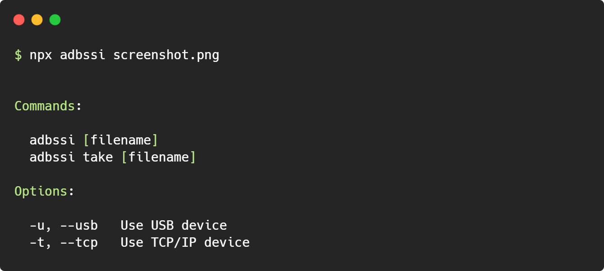

# adbssi

[ADB](https://developer.android.com/studio/command-line/adb) shell [screencap](https://developer.android.com/studio/command-line/adb#screencap) interface



### Install

```bash
npm install -g adbssi
```

### Usage

```bash
adbssi screenshot.png
```

### Requirement

-   [adb](https://adbdriver.com/downloads/) (Android Debug Bridge)
-   [node](https://nodejs.org/en/download/) (>=14)
