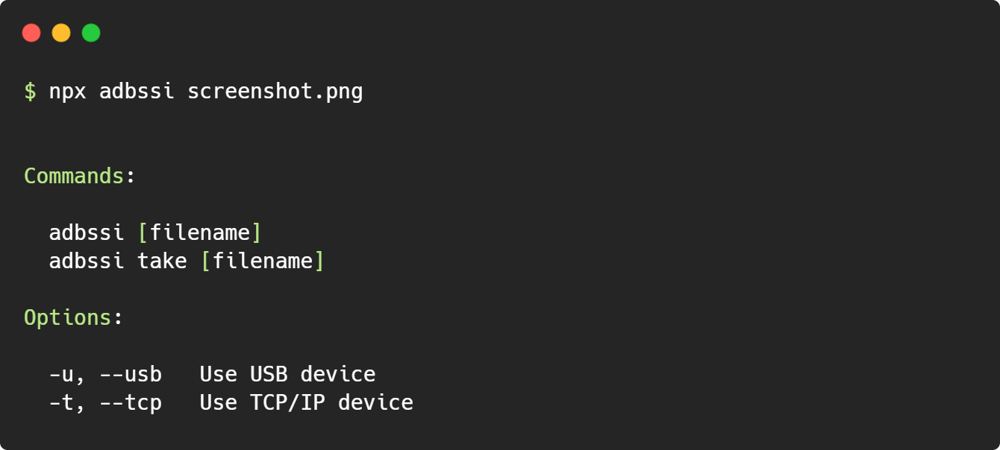

# adbssi

[ADB](#) [s](#)hell [s](#)creencap [i](#)nterface



### Install

```bash
npm install -g adbssi
```

### Usage

```bash
adbssi screenshot.png
```

#### Requirement

-   [adb](https://adbdriver.com/downloads/) (connected to device)
-   [node](https://nodejs.org/en/download/) (version >=14)

---

[Android Debug Bridge](https://developer.android.com/studio/command-line/adb/) | [Screencap](https://developer.android.com/studio/command-line/adb#screencap)
